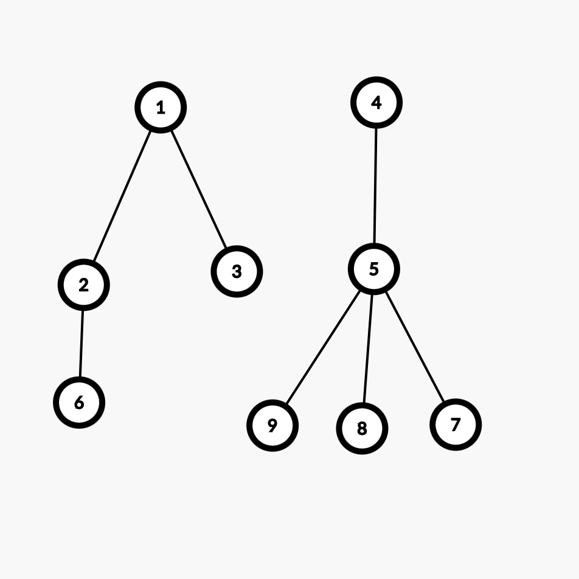
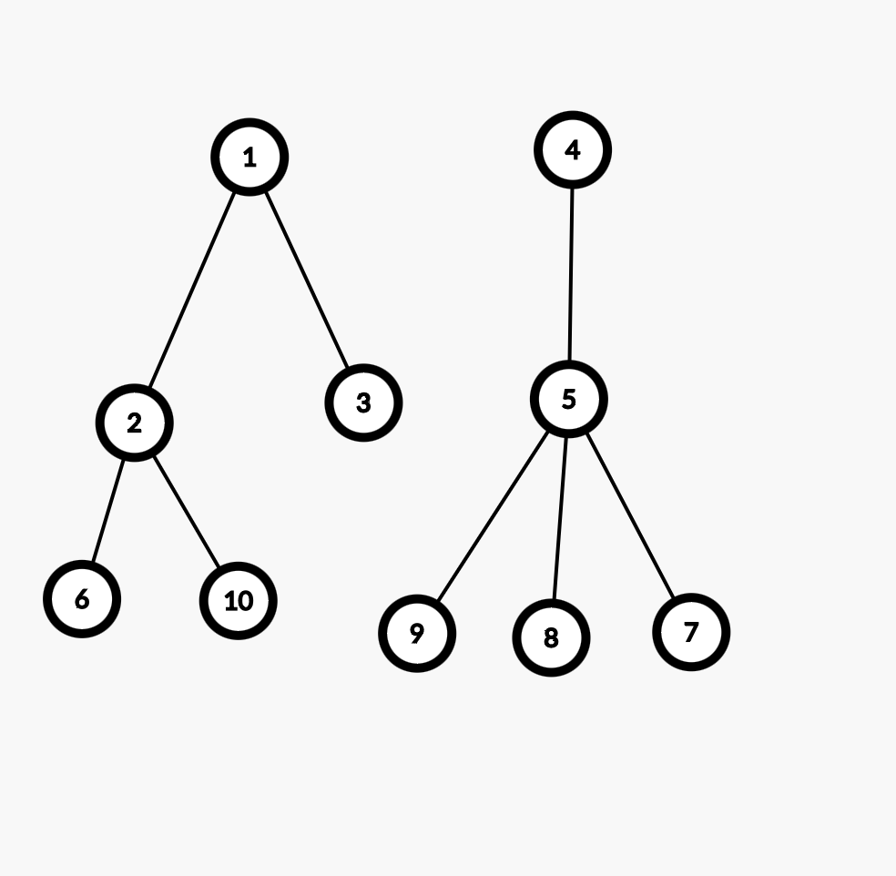
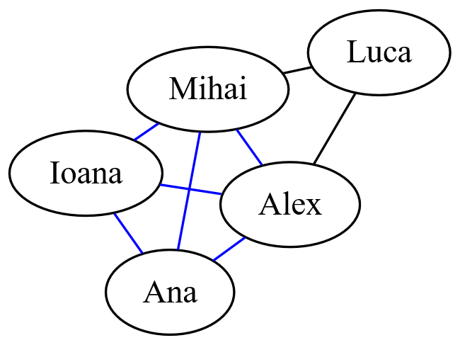

# Tema 3 SD

**Responsabili:**

- Robert Grancsa
- Baldovin Razvan-Mihai-Marian
- Chitan Rafael

Data publicării: 10.05.2024
Deadline: 26.05.2024

!Important Această temă se va face în echipe de câte 2 persoane și poate fi făcută împreună cu oricine din seria CA sau care repetă materia. Pentru corectarea mai ușoară a temelor, trebuie să aveți scris în README neapărat un mesaj sub formă:

```
Echipa tema 3 SD:
id.moodle1
id.moodle2
```

Unde id.moodle este id-ul vostru de pe Teams/Moodle, de exemplu andrei.popescu. Dacă doriți să faceți tema singuri, lucru care nu este recomandat, puteți să scrieți un singur nume.

## Actualizări

## Obiective

În urma realizării acestei teme veți:

- Învăța cum se folosesc grafurile în task-uri de zi cu zi
- Exersa implementarea structurilor de date arborescente
- Înțelege cum se implementează o platformă de social media

## Introducere

În urma brainstormingului intens, Marcel a ajuns la concluzia că ar fi benefic să-și unifice serviciile sale, în loc să le aibă separate. Astfel, el dorește să creeze propriile rețele de socializare favorite și vă solicită ajutorul pentru implementarea funcționalităților pe care le dorește în versiunea Alpha a platformei sale.

Pentru a face acest lucru, Marcel a împărțit cerințele sale în trei etape, corespunzând fiecărei părți a aplicației: prima etapă pentru partea de rețea de prietenie, a doua etapă pentru partea de postări și a treia etapă pentru combinarea tuturor într-un feed de social media.

Pentru primele două etape, puteți lucra în paralel, fără a fi nevoie de cod dintr-o etapă pentru a progresa în cealaltă. Totuși, task-ul 3 va implica combinarea muncii individuale din primele două etape pentru a crea un produs final.

Fiecare input va fi mereu valid, deci nu trebuie să vă faceți griji cu privire la tratarea cazurilor de parametri lipsă sau invalizi.

Vă recomandăm să lucrați individual la primele două etape, dar nu este obligatoriu.

Această temă este concepută astfel încât să vă permită să lucrați la ea fără a fi nevoie să utilizați cod din etapele anterioare, dar vă recomandăm să folosiți platforme precum GitHub pentru o colaborare mai ușoară între voi.

## Task 1 (Rețea de prietenie)

### Adaugă prieten

`add <nume-1> <nume-2>`

Creează o legătură între doi utilizatori. Aceasta este o legătură bidirecțională, adică ambele persoane se vor trece unul pe altul ca prieteni.

Exemplu:

```
> add Mihai Andrei
< Added connection Mihai - Andrei
```

!Info Pentru fiecare input, se garantează că nu se vor folosi utilizatori care să nu existe în listă, sau utilizatori care să se repete.

### Elimină prieten

`remove <nume-1> <nume-2>`

Elimină legătura între doi utilizatori.

Exemplu:

```
> add Mihai Andrei
> remove Mihai Andrei
< Removed connection Mihai - Andrei
```

### Află distanța

`distance <nume-1> <nume-2>`

Calculează distanța între 2 persoane de pe platformă. Distanța se consideră 1 pentru fiecare prietenie.

Exemplu:

```
> add Mihai Andrei
> add Andrei Alex
> add Alex Mihnea
> distance Mihai Mihnea
< The distance between Mihai - Mihnea is 3
```

!Info Dacă nu există o legătură între cei doi utilizatori, se va afișa "There is no way to get from \<nume-1> to \<nume-2>"

### Sugestii

`suggestions <nume>`

Găsește și afișează toți prietenii prietenilor, care nu sunt deja prieteni cu tine. Prietenii vor fi afișați crescător după id-ul utilizatorului.

Exemplu:

```
> add Alex Andrei
> add Andrei Maria
> add Andrei Mihai
> add Andrei Vlad
> suggestions Alex
< Suggestions for Alex:
< Maria
< Mihai
< Vlad
```

!Info
Dacă nu există sugestii pentru un utilizator, se va afișa "There are no suggestions for \<nume>"

### Prieteni comuni

`common <nume-1> <nume-2>`

Trebuie să găsiți prietenii comuni ai doi utilizatori. Un prieten comun este o persoană care îl are ca prieten și pe `<nume-1>` și pe `<nume-2>`. Veți afișa lista de prieteni, sortată crescător după id-ul utilizatorului.

Exemplu:

```
> common Alex Ana
< The common friends between Alex and Ana are:
< Andrei
< Maria
< Ioana
```

!Info
Dacă nu există niciun prieten comun, se va afișa: "No common friends for \<nume-1> and \<nume-2>"

### Număr de prieteni

`friends <nume>`

```
> friends Andrei
< Andrei has 5 friends
```

Trebuie să afișați numărul de conexiuni al unei persoane.

### Cel mai popular

`popular <nume>`

Trebuie să afișați utilizatorul cu cele mai multe conexiuni dintre `<nume>` și prietenii lui.

Exemplu (se presupune că Andrei - Mihai - Ana sunt toți prieteni):

```
> friends Andrei
< 10
> friends Mihai
< 15
> friends Ana
< 9
> popular Ana
< Mihai is the most popular friend of Ana
> popular Mihai
< Mihai is the most popular
```

## Task 2 (Postări și reposturi)

Pentru această etapă, vom lucra cu o structură de date arborescentă, care va fi folosită pentru a stoca postările și reposturile. Fiecare postare va avea un id unic și va putea avea mai multe reposturi. Un repost va fi o postare în sine, care va avea un id unic și va fi legată de postarea originală. Vom folosi un arbore pentru a stoca aceste postări și reposturi, unde fiecare nod va avea un câmp `events`, care va fi un arbore de postări și reposturi.

```
struct {
    id: number,
    titlu: string,
    user_id: number,
    events: tree
}
```

### Creează o postare

`create <nume> <titlu>`

Utilizatorul `<nume>` va crea o postare cu titlul `<titlu>`. Fiecare postare va avea un id unic, care va fi incrementat la fiecare postare nouă.

Exemplu:

```
> create Mihai "Titlu postare"
< Created "Titlu postare" for Mihai
```

#### Restricții

- Un utilizator poate avea mai multe postări
- Un utilizator poate avea mai multe postări cu același titlu
- Titlul unei postări poate avea maxim 280 de caractere
- ID-ul unei postări va fi un număr întreg pozitiv, unic pentru fiecare postare

### Repost

`repost <nume> <post-id> [<repost-id>]`

Creează un repost la o postare existentă. Dacă repost-ul are un repost id, atunci se consideră că este un repost la un repost.

Exemplu:

- Înainte de a rula comanda, avem:



```
> repost Alex 1 2
< Created Repost #3 for Alex
```

- După rularea comenzii, avem:



#### Restricții

- Un repost are exact aceeași structură ca o postare (id unic ce va fi incrementat, exact ca la un post normal), însă nu are un titlu dat de utilizator (îl putem seta pe NULL în structură).
- Repost-ul va fi stocat în arborele `events` al postării originale, în funcție de momentul în care a fost făcut repost-ul (poate fi fiul unui alt repost sau al postării originale).
- Câmpul de `events` al unui repost va fi gol (setat pe NULL).
- Un repost poate fi făcut și de alt utilizator decât cel care a făcut postarea originală (vom stoca id-ul celui care a făcut repost-ul în structura de repost).

### Primul repost comun

`common-repost <post> <repost-id-1> <repost-id-2>`

Găsește primul repost comun al două reposturi. Dacă nu există, se va afișa "No common reposts for `<repost-id-1>` and `<repost-id-2>`"

Exemplu:


```
> common-repost 1 4 7
< The first common repost of 4 and 7 is 2.
```

### Like

`like <nume> <post-id> [<repost-id>]`

Adaugă un like la o postare sau repostare. Dacă se dă repost id, atunci se va adăuga like-ul la repostare.

Exemplu:

```
> create Mihai "Titlu postare"
< Created "Titlu postare" for Mihai
> like Alex 0
< Alex liked "Titlu postare"
> like Alex 0
< Alex unliked "Titlu postare"
```

#### Precizări

- Un utilizator poate da like la o postare sau repostare o singură dată
- Dacă un utilizator dă comanda 'like' la o postare sau repostare la care a dat deja like, numărul de like-uri se va decrementa (va funcționa ca un dislike).
- Puteți modifica structura post_t pentru a stoca like-urile pentru un post/repost.
- Dacă un utilizator dă like la un repost, like-ul **NU** se va adăuga și la postarea originală.

### Ratio

`ratio <post-id> <repost-id>`

Vom folosi indicatorul de ratio pentru a calcula cât de popular este un repost, raportat la postarea originală și la reposturile sale.

Ratio-ul se calculează astfel: `likes_repost / sum_likes`, unde `likes_repost` este numărul de like-uri pe repost, iar `sum_likes` este suma like-urilor de pe postarea originală și toate reposturile sale (vom include doar reposturile directe, pe calea de la postul original, până la repostul curent) - afișat cu 2 zecimale.

Exemplu:
Considerând exemplul de mai sus (cel de la comanda 'common-repost') și presupunând că fiecare postare/repost are exact un like, avem:

```
> ratio 7
< The ratio of Repost #7 by Alex is 0.33.
```

Nota - se afișează numele utilizatorului care a dat repostul.

### Delete Post/Repost

`delete <post> [<repost-id>]`

Șterge o postare sau un repost. Odată ce o postare sau un repost a fost șters, toate reposturile care depind de aceasta vor fi șterse.

!Warning Atentie - ID-urile postarilor și reposturilor nu se vor reutiliza.

Exemplu:

```
> delete 0
< Deleted "Titlu postare"
```

### Get likes

`get-likes <post-id> [<repost-id>]`

Afișează numărul de like-uri pentru o postare sau repostare.

Exemplu:

```
> get-likes 1 2
< Repost #2 has 5 likes
> get-likes 0
< Post "Titlu postare" has 0 likes
```

### Get reposts

`get-reposts <post/repost-id>`

Afișează toată ierarhia de reposturi pentru un post/repost.

Se vor afișa reposturile în ordinea în care au fost făcute, alături de numele utilizatorului care a făcut repostul. Spre exemplu, vom considera următorul arbore de events pentru postarea cu id-ul 1:


Vom considera că titlul primei postări este `Cat video`, iar toate reposturile au fost făcute de același utilizator - `Alex`.

```
> get-reposts 1
< "Cat video" - Post #1 by Alex
< Repost #2 by Alex
< Repost #4 by Alex
< Repost #5 by Alex
< Repost #7 by Alex
< Repost #3 by Alex
< Repost #6 by Alex
```

#### Restricții

* Se vor afișa toate reposturile de pe un nivel în ordine crescătoare a ID-ului
* Dacă un repost are reposturi, acestea vor fi afișate în ordine crescătoare a ID-ului, înainte de a se afișa următorul repost de pe același nivel

## Task 3 (Social Media)

### Feed

`feed <nume> <feed-size>`

Afișează cele mai recente `<feed-size>` postări ale unui utilizator și ale prietenilor lui.

Exemplu:

```
> create Andrei "Prima mea postare"
> create Mihai "Al doilea"
> create Mihnea "Vand Golf 4"
> create Alex "Buna TPU, merita sa dau la Poli?"
> create Ana "Ati auzit ultima melodie a lui Kanye?"
> create Luca "Nu-mi vine sa cred cine a castigat Grand Prix-ul de la Miami"
> feed Andrei 5
< Luca: Nu-mi vine sa cred cine a castigat Grand Prix-ul de la Miami
< Ana: Ati auzit ultima melodie a lui Kanye?
< Alex: Buna TPU, merita sa dau la Poli?
< Mihnea: Vand Golf 4
< Mihai: Al doilea
```

### View profile

`view-profile <nume>`

Afișează toate postările și repostările unui utilizator.

Exemplu:

```
> create Andrei "Prima mea postare"
> create Mihai "Al doilea"
> create Alex "Shaorma e veatza mea"
> repost Andrei 2
> view-profile Andrei
< Posted: "Prima mea postare"
< Reposted: "Shaorma e veatza mea"
```

### Friends that reposted

`friends-repost <nume> <post-id>`

Afișează toți prietenii unui utilizator care au dat repost la postarea cu `<post-id>`-ul primit.

Exemplu:

```
...
> repost Mihai 5
> repost Alex 5
> repost Ana 5
> friends-repost Andrei 5
< Friends that reposted:
< Mihai
< Alex
< Ana
```

### Clică

`common-group <nume>`

Găsiți și afișați cel mai mare grup de prieteni care îl conține pe un anumit utilizator.

Un grup de prieteni se definește ca toți oamenii dintr-un grup care sunt prieteni unii cu alții. Lista de nume afișată va fi afișată crescător după id-ul utilizatorului.

Exemplu:



```
> common-group Alex
< The closest friend group of Alex is:
< Alex
< Ana
< Ioana
< Mihai
> common-group Luca
< The closest friend group of Luca is:
< Alex
< Mihai
< Luca
```

Din graful acesta, se poate vedea cum Ana - Alex - Ioana - Mihai alcătuiesc un grup complet, iar Luca nu face parte din acest grup, fiindcă are doar 2 prieteni comuni.

!Info
O clică poate fi formată și dintr-un singur utilizator, caz în care afișăm doar numele lui la output

## Link-uri utile

https://en.wikipedia.org/wiki/Bron%E2%80%93Kerbosch_algorithm#Without_pivoting

## Recomandări

Pentru a putea lucra mai ușor, avem câteva tips-uri pentru voi.

1. Folosiți GitHub într-un mod care să vă facă viața mai ușoară. Vă recomandăm să nu scrieți tot codul în main, să vă creați [câte un branch pentru fiecare task](https://www.atlassian.com/git/tutorials/comparing-workflows/feature-branch-workflow), iar mai apoi să vă creați [Pull Request-uri](https://www.atlassian.com/git/tutorials/making-a-pull-request) pentru a reduce numărul de conflicte.
2. Pentru a lucra mai ușor cu GitHub, vă recomandăm să faceți un fork **PRIVAT** al repo-ului nostru, în care să vă invitați coechipierul și să scrieți codul direct acolo.
3. Un plus dacă folosiți GitHub, e că puteți să vă folosiți de checkerul de pe Moodle de fiecare dată când dați push pe orice branch, și puteți vedea rezultatele rulării la tab-ul de actions. În continuare o să trebuiască să încărcați tema pe Moodle, dar e un mod mai ușor de a face debug, ambele rulează pe același sistem, așadar problemele de pe Moodle vor apărea și aici, și viceversa.

## Punctaj

- Task 1 - 30p
- Task 2 - 30p
- Task 3 - 30p
- Coding style si claritatea explicatiilor din README - 10p

## FAQ

Q: Putem implementa tema în C++?
A: Nu.

Q: Putem folosi variabile globale?
A: Nu.

Q: Putem modifica scheletul / adăuga funcţii?
A: Da.

Q: Putem face singur tema?
A: Da, dar punctajul nu se scaleaza, iar tu vei avea mai mult de lucru.

## Checker

> ! Atentie, checkerul ruleaza toate testele cu valgrind. Daca aveti erori de
valgrind nu primiti punctajul pe checkerul de pe moodle. Pentru a activa
valgrind-ul pe checker, apasati tasta `v` si va aparea chenarul rosu.

### Pași de instalare

!Info Dacă ați mai avut instalat checkerul de la tema 1 de la IOCLA, puteți să săriți direct la pasul 2.

Puteți instala checkerul rulând comanda `./install.sh`.
Dacă apar orice fel de erori când rulați comanda, încercați și urmați următorii pași:

1. Descărcați rustup (ar trebui să fie independent de platformă)
`curl https://sh.rustup.rs -sSf | sh -s -- -y`. Dacă apar erori la
următorii pași, încercați să adăugați cargo (package managerul de rust) la
PATH, rulând următoarea comandă `source "$HOME/.cargo/env"`.

2. Rulați următoarea comandă ca să instalați checkerul:

```bash
$ cargo install hw_checker
```

După instalare, puteți rula direct checkerul folosind comanda `hw_checker` din root-ul temei, sau puteți face un symbolic link la folderul curent.

### Instrucțiuni checker

Pentru o listă completă de comenzi pentru checker, puteți citi README-ul din `README-checker.md`. Dacă aveți probleme cu interfața grafică, puteți rula checkerul fără interfața grafică, folosind comanda `hw_checker --legacy`
